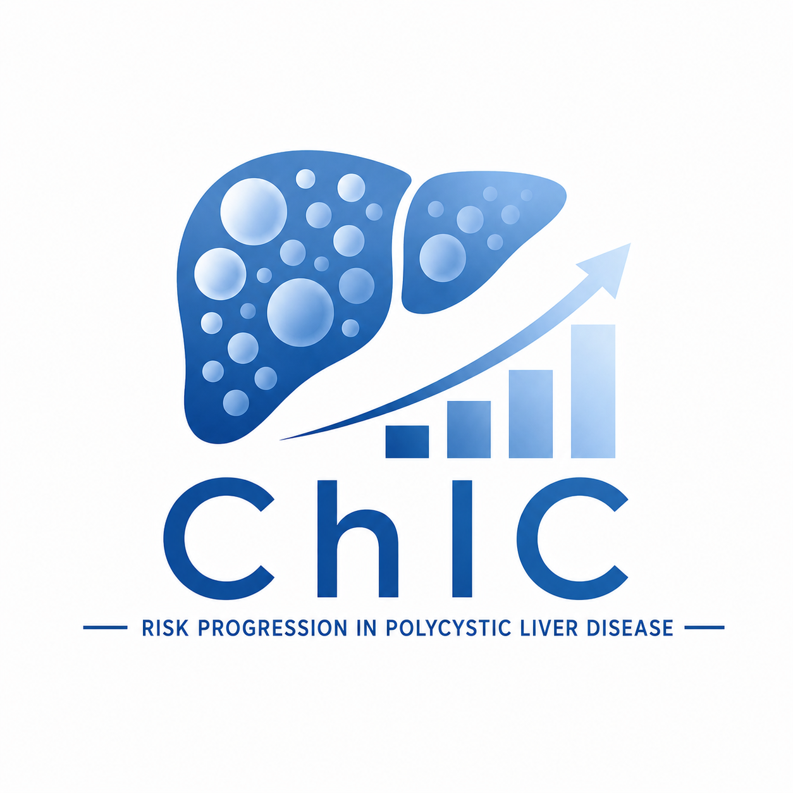

<p align="center">
   
</p>

<h1 align="center">Charité Imaging Classification (ChIC)</h1>

<p align="center">
  An interactive web app for the prognostic assessment of <strong>Polycystic Liver Disease</strong> progression.
</p>

<p align="center">
  <a href="https://github.com/halbritter-lab/ChIC/actions/workflows/ci.yml"></a>
  <a href="LICENSE"></a>
  <a href="https://halbritter-lab.github.io/ChIC/"></a>
  <a href="docs/README.md"></a>
</p>

<p align="center">
  
  
  
  
</p>

---

## About

The **Charité Imaging Classification (ChIC)** helps clinicians and researchers assess and visualize the progression of **Polycystic Liver Disease**. It stratifies prognosis from **height-adjusted total liver volume (htTLV)** and **age**, assigning a Charité Imaging Class (**A–E**) and estimating the future risk of liver events. All computation runs in your browser and no data leaves your device. Try it [here](https://halbritter-lab.github.io/ChIC/).

> ChIC is an **informational, educational, and research tool — not a diagnostic device.** See the full disclaimer [here](docs/disclaimer.md).

## Documentation

Full documentation lives in [**`docs/`**](docs/README.md):

| Page                                               | What it covers                                                                              |
| -------------------------------------------------- | ------------------------------------------------------------------------------------------- |
| [Clinical background](clinical-background.md)   | What PLD is, the science behind the classification, its publication history and the model. |
| [User guide](user-guide.md)                     | Features and an annotated walkthrough of every part of the interface.                       |
| [Data formats](data-formats.md)                 | Batch **import** (Excel / CSV / JSON) and **export** (Excel / CSV / JSON / PNG) reference.  |
| [URL parameters](url-parameters.md)             | Preset inputs and embed/kiosk mode via URL query parameters.                                |
| [Privacy & offline use](privacy-and-offline.md) | Client-side data storage and Progressive Web App (PWA) install/offline behaviour.           |
| [Disclaimer](disclaimer.md)                     | Full disclaimer and usage guidelines.                                                       |
| [Citation & credits](citation.md)               | How to cite the ChIC, plus creators and contributors.                                           |

## Quick start

```bash
npm ci         # install dependencies (Node 20 — see .nvmrc)
npm run dev    # dev server on http://localhost:8137
npm run build  # production build -> dist/
npm test       # run the Vitest suite
```

See [CONTRIBUTING.md](CONTRIBUTING.md) for the full development guide and quality gates, and [AGENTS.md](AGENTS.md) for architecture, conventions, and load-bearing invariants.

## Tech stack

**Vue 3** + **Vite 6** · **Chart.js 4** · **exceljs** · **vite-plugin-pwa** · ESLint + Prettier + Vitest. Plain JavaScript, deployed to **GitHub Pages**.

## Citation

If you use ChIC in research or publication, please cite the ChIC paper (DOI/PMID forthcoming). Details in [Citation & credits](docs/citation.md).

## License

[MIT](LICENSE) © 2026 Carolin Brigl and contributors.

## Contact

Email <jan.halbritter@charite.de> or [open an issue](https://github.com/halbritter-lab/ChIC/issues).
