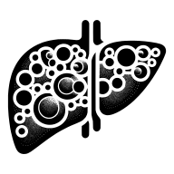
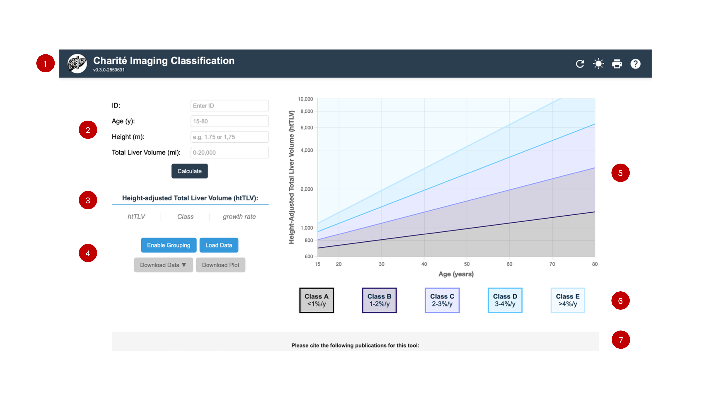

   

# Charité Imaging Classification

Please explore the [Charité Imaging Classification](https://halbritter-lab.github.io/pld-progression-grouper/) app hosted on GitHub pages.

## Introduction

The Charité Imaging Classification (ChIC) for Polycystic Liver Disease (PLD) is an interactive web application designed to assist in the prognostic assessment of Autosomal Dominant Polycystic Liver Disease (ADPLD) and PLD within the context of Autosomal Dominant Polycystic Kidney Disease (ADPKD). Based on a recent study titled "ChIC Paper" [PMID:TBD](https://pubmed.ncbi.nlm.nih.gov/TBD/), this tool aims to facilitate the visualization of disease progression and estimates the future risk of liver events in individuals with PLD.

PLD, characterized by numerous fluid-filled cysts arising from intrahepatic biliary epithelia, is a mostly genetic cholangiopathy with significant clinical heterogeneity. The presentation of PLD can vary widely with some patients never expieriencing symptoms and others requiring medication or procedural intervention, in rare cases even liver transplantation. The application uses height-adjusted total liver volume (htTLV) and age and leverages data from three tertiary care centers and two previous studies for prognostic risk stratification in PLD.

## Tool Development

The principle of the "Charité Imaging Classification" tool was first published in 2022, highlighting its application in the study of PLD within the context of both Autosomal Dominant Polycystic Kidney Disease (ADPKD) and Autosomal Dominant Polycystic Liver Disease (ADPLD). This version of the tool had a three-group system and used the endpoint "liver hospitalizations". For more details on the publication, see [PMID:36246085](https://pubmed.ncbi.nlm.nih.gov/36246085/).

The tool was validated in a second study of only ADPLD patients in 2024. For more details on the publication, see [PMID:38101549](https://pubmed.ncbi.nlm.nih.gov/38101549/).

In 2026 the calssification underwent significant revision. The new classification system has expanded to a five-group system to better cover the range of disease presentation. It also uses htTLV and an expanded endpoint "liver events" to better align with progress in the PLD field. Additionally, the classification has expanded to cover the ages 15-85 and shows improved stratification of paitents under 30. For more details on the publication, see [PMID:TBD](https://pubmed.ncbi.nlm.nih.gov/TBD/).

## Features

- **Data Input and Visualization:** Users can input individual-specific data, including age, height, and total liver volume, to visualize the height-adjusted total liver volume (htTLV) on a chart.
- **Data Analysis:** The app plots four key trend lines based on the formulas derived from the study, offering visual insight into the Charité Imaging Classes as defined in the research.
- **Dynamic Interaction:** Users can interactively plot new data points on the chart, assisting in the analysis of individual trajectories. Points can be edited after input by clicking on the data row or point, and can be removed using the remove button.
- **Download and Print Options:** The application allows for downloading the plotted chart and printing the page for offline analysis and record-keeping.
- **Batch Analysis:** Batch analysis is also possible via the enable grouping button.

## Technical Overview

The application is built using Vue.js and Chart.js, ensuring a responsive and interactive user experience. The layout is designed with controls and input fields on the left and the chart on the right, facilitating ease of use and clear data presentation.

## Webapp usage and application components

   

1. **Application Header**
   - **(1a) Logo**: Displays the logo of the Charité Imaging Classification application.
   - **(1b) Title**: Shows the name of the application.
   - **(1c) Version Tag**: Indicates the current version of the application.
   - **(1d) Reset Button**: Clears all data and input fields to start a new session.
   - **(1e) Night Mode Toggle**: Switches the application between light and dark theme for better visibility in different lighting conditions.
   - **(1f) Print Button**: Opens the print dialog to print the current page with all visualizations.
   - **(1g) FAQ Button**: Opens the frequently asked questions panel with helpful information about using the application.

2. **User Input Area**
   - **(2a) ID Field**: Where users can enter a unique identifier for the data point they are entering or analyzing.
   - **(2b) Age Input**: Users can input the age of the patient in years (15-80 years).
   - **(2c) Height Input**: Users can input the patient's height in meters (for calculating height-adjusted TLV).
   - **(2d) Total Liver Volume (TLV) Input**: Users can input the total liver volume measured in milliliters.

3. **Computed Outputs**
   - **(3a) Height-adjusted Total Liver Volume (htTLV)**: This field displays the calculated height-adjusted total liver volume based on the input TLV divided by height in meters.
   - **(3b) Charité Imaging Class (Class) Indicator**: Shows the Charité Imaging Class classification based on the computed htTLV and age.
   - **(3c) Liver Growth Rate (LGR)**: Displays the percentage change in liver volume per year (%/y) based on serial measurements.

4. **Action Buttons**
   - **(4a) Calculate**: Submits the entered data and plots the point on the graph.
   - **(4b) Print Page**: Allows the user to print the current page.
   - **(4c) Download Chart**: Enables the user to download the displayed plot as an image.
   - **(4d) Download Data**: Exports the data table in JSON, CSV, or Excel format with consistent column formatting.
   - **(4e) Load Data**: Loads data from a selected JSON file and updates the table and plot accordingly.

5. **Chart Area**
   - Displays a scatter plot graph illustrating the relationship between age and htTLV, with trend lines indicating progression thresholds.

6. **Charité Imaging Classes Legend**
   - **Class A** — <1% growth per year — Very slow progression
   - **Class B** — 1–2% growth per year — Slow progression
   - **Class C** — 2–3% growth per year — Moderate progression
   - **Class D** — 3–4% growth per year — Rapid progression
   - **Class E** — >4% growth per year — Very rapid progression

7. **Additional Information and Footer**
   - **(7a) Citation Information**: Contains bibliographic information to cite when using the application for research or publication purposes.
   - **(7b) Documentation Link**: Provides a link to the GitHub README for detailed documentation of the application and its methodologies. Includes a feedback form for user suggestions and bug reports.
   - **(7c) Institution Logo**: Shows the logo of the associated medical institution.
   - **(7d) Funder Logo**: Displays the logo of the funding organization.

8. **Data Table** *(not visible in the screenshot)*
   - If present, this would display a table of all data points entered, including ID, age, height, TLV, htTLV, Charité Imaging Class, and an option to remove data points.

Each numbered item refers to a different component or section of the app. Users interact with these components to input data, receive computed outputs, manage the data points, and utilize the results for further analysis or documentation.

## URL API Documentation

### Overview
The Charité Imaging Classification tool supports URL query parameters, allowing users to preset input fields directly through the URL. This feature enables easy sharing of specific configurations and faster access to the tool with predefined settings.

### Query flags
The tool accepts the following query parameters:

1. `patientId`: Sets the patient's ID.
2. `age`: Sets the patient's age.
3. `height`: Sets the patient's height in meters (for calculating height-adjusted TLV).
4. `tlv`: Sets the Total Liver Volume (TLV) in milliliters.
5. `acknowledgeBanner`: Sets the banner acknowledgement state. Accepts `true` or `false`.
6. `showFooter`: Controls the visibility of the footer. Accepts `true` or `false`.
7. `showCitation`: Toggles the display of citation information. Accepts `true` or `false`.
8. `showDocumentation`: Determines if the documentation link is shown. Accepts `true` or `false`.
9. `showControls`: Enables or disables the display of the user input controls. Accepts `true` or `false`.

### Usage examples
- **Setting ID and age**: 
This URL sets the patient's ID to "12345" and age to "50".
`https://[YOUR_DOMAIN]/pld-progression-grouper/?patientId=12345&age=50`

- **Setting all parameters**:
This URL sets the patient's ID to "12345", age to "50", and Total Liver Volume to "15000 ml" and acknowledges the banner.
`https://[YOUR_DOMAIN]/pld-progression-grouper/?patientId=12345&age=50&tlv=15000&acknowledgeBanner=true`

- **Setting view controls**:
This URL will hide the footer and controls but display the citation information and documentation link.
`https://[YOUR_DOMAIN]/pld-progression-grouper/?showFooter=false&showCitation=true&showDocumentation=true&showControls=false`

## Data Privacy and Storage

### Local Data Storage
The Charité Imaging Classification is designed to prioritize user privacy and data security:
- **Client-Side Data Storage**: All data input into the application is stored locally on the user's device. No personal or sensitive data is sent to or stored on a server.
- **Data Security**: By keeping data client-side, the risk of data breaches is minimized, ensuring user data remains private and secure.

## Input Formats

### Batch Upload
The application supports batch uploading of multiple patient records at once using the following formats:
- **Excel (XLSX)**: Upload patient data from Excel spreadsheets. Each row should contain: ID, Age (years), Height (meters), TLV (milliliters), and optionally Group and GroupColor.
- **CSV**: Import comma-separated values files with the same column structure as Excel files. This format is universally compatible with all spreadsheet applications.
- **JSON**: Upload data in JSON format for technical users. The file should contain an array of patient objects with properties: id, age, height, tlv, group (optional), and groupColor (optional).

All batch uploads will add the records to the chart and data table, allowing for immediate visualization and analysis of multiple patients.

## Output Formats

### Export Options
Users can export their data in various formats for ease of use and flexibility:
- **Excel (XLSX)**: For users who prefer spreadsheet analysis, data can be exported in Excel format with proper number formatting.
- **CSV**: Comma-separated values format for universal compatibility with all spreadsheet applications.
- **JSON**: Offering a more technical format, data can be saved as JSON files, which are ideal for further processing or integration with other applications.
- **PNG**: The application allows users to download charts as PNG images, perfect for presentations or reports.

All export formats include the complete data table columns: ID, Age (y), Height (m), TLV (ml), htTLV, Class, and LGR (%/y), with consistent number formatting.

## Progressive Web App (PWA) support

The Charité Imaging Classification is also available as a Progressive Web App (PWA), providing a more integrated and efficient user experience.
The PWA is compatible with most modern browsers on both desktop and mobile devices. For the best experience, ensure your browser is up to date.

### Installing the PWA

1. **Access the Tool**: Open the Charité Imaging Classification in your web browser.
2. **Install Prompt**: A prompt to "Add to Home Screen" will appear if you are using a compatible browser.
3. **Confirm Installation**: Click the prompt to install the application on your device.
4. **Access from Home Screen**: Once installed, the app can be accessed directly from your home screen, just like any other installed application.

### Usage

- **Offline access**: The PWA can be used offline, making it convenient for users without constant internet access.
- **Faster load times**: As a PWA, the application loads faster, providing a smoother user experience.
- **Regular updates**: The app will update automatically with the latest features and improvements when online.

## Limitations and Relevance

While the tool is based on a large cohort study, it's important to acknowledge the limitations in generalizability due to the cohort size. The tool serves a research purpose, offering a new approach to understanding the progression of ADPLD and assisting in decision-making for individuals with PLD.

## Contributions

This tool is an open-source project and contributions are welcome. Whether it's feature enhancement, bug fixing, or improvements in the algorithm, your input is valuable.

## Citation policy

- Please cite the following publication for this tool:
[ChIC Paper Citation](https://pubmed.ncbi.nlm.nih.gov/tbd/)

## Copyright and license

- All code from this project is licensed under the "MIT No Attribution" (MIT-0) License.  For more information, please refer to the [License](LICENSE.md) file.

## Creators and contributors

**Carolin Brigl**

- <https://github.com/CBrigl>
- <https://orcid.org/0009-0008-2094-3440>

**Bernt Popp**

- <https://twitter.com/berntpopp>
- <https://github.com/berntpopp>
- <https://orcid.org/0000-0002-3679-1081>
- <https://scholar.google.com/citations?user=Uvhu3t0AAAAJ>

**Dana Sierks**
- <https://github.com/SIERKSd>
- <https://orcid.org/0000-0002-3850-7646>

**Ria Schönauer**

- <https://github.com/RARSchoen>
- <https://orcid.org/0000-0001-7609-3061>

**Jan Halbritter**

- <https://github.com/halbrijp>
- <https://orcid.org/0000-0002-1377-9880>
- <https://scholar.google.com/citations?user=Jt1S5fkAAAAJ>

## Contact

If you have any questions, suggestions, or feedback, please feel free to [contact us](contact.md).
