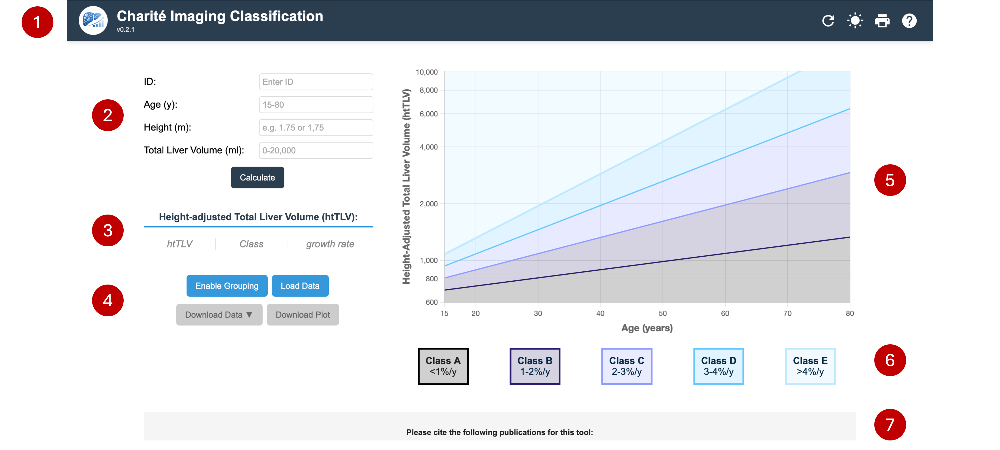

# User guide

[← Documentation home](README.md)

## Features

- **Data input and visualization** — Enter patient-specific data (age, height, total liver volume) to visualize the height-adjusted total liver volume (htTLV) on a chart.
- **Data analysis** — The app plots the trend lines derived from the study, giving visual insight into the Charité Imaging Classes.
- **Dynamic interaction** — Plot new data points interactively to analyze individual trajectories. Points can be edited after entry by clicking the data row or point, and removed with the remove button.
- **Download and print** — Download the plotted chart and print the page for offline analysis and record-keeping.
- **Batch analysis** — Analyze multiple patients at once via the _Enable grouping_ button. See [Data formats](data-formats.md) for import/export details.

## Interface walkthrough

   

Each numbered item below refers to a component in the screenshot above.

### 1. Application header

- **(1a) Logo** — the Charité Imaging Classification logo.
- **(1b) Title** — the name of the application.
- **(1c) Version tag** — the current version of the application.
- **(1d) Reset button** — clears all data and input fields to start a new session.
- **(1e) Night-mode toggle** — switches between light and dark themes.
- **(1f) Print button** — opens the print dialog for the current page and its visualizations.
- **(1g) FAQ button** — opens the frequently-asked-questions panel.

### 2. User input area

- **(2a) ID field** — a unique identifier for the data point being entered or analyzed.
- **(2b) Age input** — patient age in years (**15–85**).
- **(2c) Height input** — patient height in meters (used to calculate height-adjusted TLV).
- **(2d) Total Liver Volume (TLV) input** — total liver volume in milliliters.

### 3. Computed outputs

- **(3a) Height-adjusted Total Liver Volume (htTLV)** — calculated as TLV divided by height in meters.
- **(3b) Charité Imaging Class indicator** — the class (A–E) based on the computed htTLV and age.
- **(3c) Liver Growth Rate (LGR)** — the percentage change in liver volume per year (% / y), derived from serial measurements.

### 4. Action buttons

- **(4a) Calculate** — submits the entered data and plots the point on the graph.
- **(4b) Print page** — prints the current page.
- **(4c) Download chart** — downloads the displayed plot as an image.
- **(4d) Download data** — exports the data table in JSON, CSV, or Excel format.
- **(4e) Load data** — loads data from a selected file and updates the table and plot.

### 5. Chart area

A scatter plot showing the relationship between age and htTLV, with trend lines indicating the progression thresholds.

### 6. Charité Imaging Classes legend

| Class       | Growth per year | Progression |
| ----------- | --------------- | ----------- |
| **Class A** | < 1 %           | Very slow   |
| **Class B** | 1–2 %           | Slow        |
| **Class C** | 2–3 %           | Moderate    |
| **Class D** | 3–4 %           | Rapid       |
| **Class E** | > 4 %           | Very rapid  |

### 7. Additional information and footer

- **(7a) Citation information** — bibliographic details to cite when using the application (see [Citation & credits](citation.md)).
- **(7b) Documentation link** — a link to this documentation, plus a feedback form for suggestions and bug reports.
- **(7c) Institution logo** — the associated medical institution.
- **(7d) Funder logo** — the funding organization.

### 8. Data table _(not shown in the screenshot)_

When present, the data table lists every entered data point — ID, age, height, TLV, htTLV, Charité Imaging Class — with an option to remove points.
